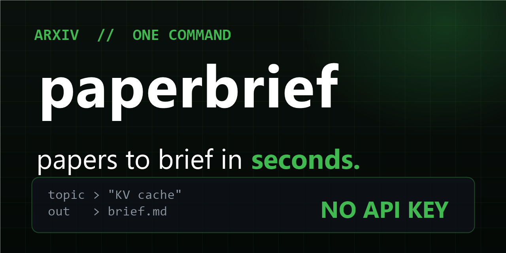

# Paperbrief — arXiv to research digest in one command



[](LICENSE)
[](https://github.com/Figo-star/paperbrief/stargazers)
[](https://github.com/Figo-star/paperbrief/commits/master)

**Any topic → ranked papers with TL;DRs, links, and dates. No API key, no dependencies.**

```
$ node bin/paperbrief.mjs brief "KV cache optimization" --n 5
# Paperbrief: KV cache optimization
## 1. PolyKV: A Shared Asymmetrically-Compressed KV Cache Pool ...
- **Authors:** Ishan Patel, Ishan Joshi
- **Published:** 2026-04-27 · **arXiv:** 2604.24971v1
- **Links:** [abs] · [pdf]
- **TL;DR:** Multiple concurrent inference agents share a single,
  asymmetrically compressed KV cache pool...
```

## The 30-second version

- **`search <topic>`** — top-N most relevant arXiv papers, one line each.
- **`brief <topic> [--n=8] [--out=file.md]`** — full digest: ranked papers, authors, dates, abs+pdf links, two-sentence TL;DRs.
- **Zero-dep, no key** — talks straight to arXiv's open API. Node 18+.

## Install

```bash
git clone https://github.com/Figo-star/paperbrief.git
cd paperbrief
node bin/paperbrief.mjs brief "diffusion language models" --n 5 --out brief.md
```

Drop `SKILL.md` into your agent (OpenCode, Claude Code, Codex…) and type `/paperbrief <topic>`.

## Honest limits

- Digests come from **abstracts only** — read the PDFs before citing anything.
- arXiv rate-limits to ~1 request / 3s; the CLI makes exactly one request per run.
- No citation counts (arXiv doesn't provide them) — relevance ranking comes from arXiv itself.

## License

MIT — see [LICENSE](LICENSE).
